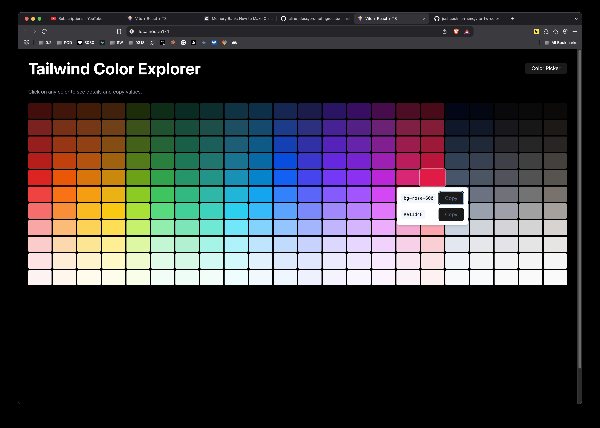

# Vite TW Color - Tailwind Color Explorer

Vite TW Color is an interactive web application designed to help designers and developers explore and experiment with Tailwind CSS color combinations. It provides a visual way to create, preview, and export color palettes for use in your projects.



## Features

### Interactive Color Grid
- View all Tailwind colors in an organized, responsive grid
- See both Tailwind class names and hex values for each color
- Copy color values directly from the UI
- Compact color flyout menu for quick color selection

### Component Previews (Coming Soon)
- Preview your color selections on common UI components
- Login card with email and password fields
- Profile card with user information
- Settings card with dropdown menu and toggle switches

### Palette Management (In Progress)
- Create temporary color palettes
- Apply palettes to preview components in real-time
- Save and load palettes

### Export Functionality (Coming Soon)
- Download palette as JSON for use in other projects
- Copy color values in various formats (Tailwind classes, hex, RGB)

## Current Status

Vite TW Color is currently in its initial development phase. Here's what's working:

- ✅ Basic project setup with Vite, React, TypeScript, and Tailwind CSS
- ✅ Interactive TailwindColorGrid component with all Tailwind colors
- ✅ Click-to-copy functionality for Tailwind class names and hex values
- ✅ Responsive grid layout that adapts to different screen sizes
- ✅ Enhanced visual design with hover effects and visual feedback
- ✅ Compact ColorFlyoutMenu component for quick color selection

In progress:
- 🔄 Color selection for building palettes
- 🔄 Palette state management

## Tech Stack

- **Frontend Framework**: React 19 with TypeScript
- **Build Tool**: Vite
- **Styling**: Tailwind CSS
- **UI Components**: shadcn/ui (built on Radix UI primitives)
- **Icons**: Lucide React
- **Form Handling**: React Hook Form with Zod validation
- **Package Manager**: pnpm

## Getting Started

### Prerequisites

- Node.js (v18 or higher)
- pnpm (v8 or higher)

### Installation

1. Clone the repository:
   ```bash
   git clone https://github.com/yourusername/vite-tw-color.git
   cd vite-tw-color
   ```

2. Install dependencies:
   ```bash
   pnpm install
   ```

3. Start the development server:
   ```bash
   pnpm dev
   ```

4. Open your browser and navigate to:
   ```
   http://localhost:5173
   ```

### Build for Production

```bash
pnpm build
```

### Preview Production Build

```bash
pnpm preview
```

## Usage

1. **Explore Colors**: Browse through the color grid to see all available Tailwind colors.
2. **Copy Color Values**: Click on any color swatch to copy its Tailwind class name or hex value.
3. **Create Palettes**: (Coming soon) Select colors to create a temporary palette.
4. **Preview Components**: (Coming soon) See how your selected colors look on common UI components.
5. **Export Palette**: (Coming soon) Export your color palette as JSON for use in other projects.

## Project Structure

```
src/
├── App.tsx                # Main application entry point
├── features/              # Feature modules
│   ├── color-grid/        # Color grid feature
│   │   ├── components/    # Feature-specific components
│   │   └── index.ts       # Feature exports
├── components/            # Shared components
│   └── ui/                # shadcn/ui components
├── hooks/                 # Shared hooks
├── lib/                   # Utility functions and helpers
└── assets/                # Static assets
```

## License

This project is licensed under the MIT License - see the [LICENSE](LICENSE) file for details.

## Free to Use As Is

This project is provided as-is, with no restrictions on usage. You are free to use, modify, and distribute it without any obligations.

---

Built with ❤️ using React, TypeScript, and Tailwind CSS.
