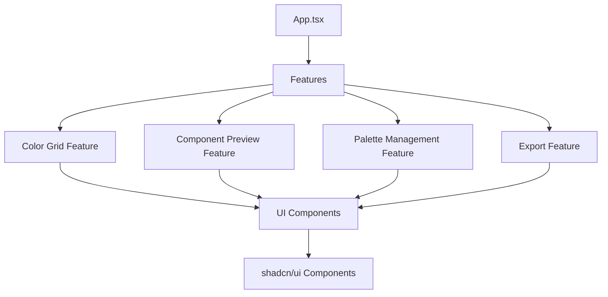
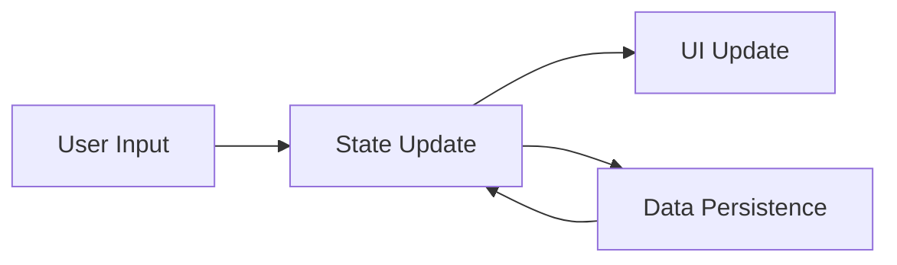
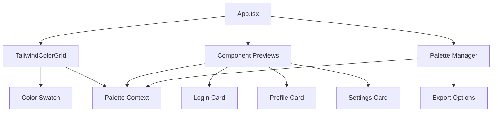

# System Patterns: Moops - Tailwind Color Explorer

## Architecture Overview

Moops follows a feature-based architecture with clear separation of concerns. The application is built using React with TypeScript and organized around feature modules.



## Directory Structure

The project follows a feature-based directory structure:

```
src/
├── App.tsx                # Main application entry point
├── features/              # Feature modules
│   ├── color-grid/        # Color grid feature
│   │   ├── components/    # Feature-specific components
│   │   ├── hooks/         # Feature-specific hooks
│   │   └── index.ts       # Feature exports
│   ├── component-preview/ # Component preview feature (planned)
│   ├── palette-manager/   # Palette management feature (planned)
│   └── export/            # Export functionality feature (planned)
├── components/            # Shared components
│   └── ui/                # shadcn/ui components
├── hooks/                 # Shared hooks
├── lib/                   # Utility functions and helpers
└── assets/                # Static assets
```

## Design Patterns

### Feature Module Pattern

Each feature is encapsulated in its own directory with all related components, hooks, and utilities. This promotes:

- **Modularity**: Features can be developed and tested independently
- **Maintainability**: Changes to one feature don't affect others
- **Scalability**: New features can be added without modifying existing code

### Component Composition

UI is built using a composition of smaller, reusable components:

- **Base Components**: shadcn/ui components provide the foundation
- **Feature Components**: Specialized components built for specific features
- **Layout Components**: Handle arrangement and organization of UI elements

### State Management

The application uses React's built-in state management with a combination of:

- **Local Component State**: For UI-specific state
- **Context API**: For sharing state across components within a feature
- **Custom Hooks**: For encapsulating and reusing stateful logic

### Data Flow



- **Unidirectional Data Flow**: State changes flow down through the component tree
- **Event Handlers**: Capture user interactions and update state
- **Derived State**: Computed values based on application state

## Key Technical Decisions

1. **shadcn/ui Components**: Using shadcn/ui for consistent, accessible UI components that can be easily styled with Tailwind CSS.

2. **Feature-Based Organization**: Structuring the codebase around features rather than technical concerns to improve maintainability and developer experience.

3. **TypeScript**: Using TypeScript for type safety and improved developer experience.

4. **Tailwind CSS**: Using Tailwind for styling to maintain consistency with the application's purpose of exploring Tailwind colors.

5. **Vite**: Using Vite as the build tool for fast development and optimized production builds.

## Component Relationships



## Extensibility Points

The system is designed with several extensibility points:

1. **New UI Components**: Additional preview components can be added to demonstrate color applications.

2. **Color Format Support**: The system can be extended to support additional color formats beyond Tailwind classes and hex values.

3. **Persistence Options**: Additional storage options can be implemented for saving and loading palettes.

4. **Export Formats**: New export formats can be added to support different frameworks or design tools.
